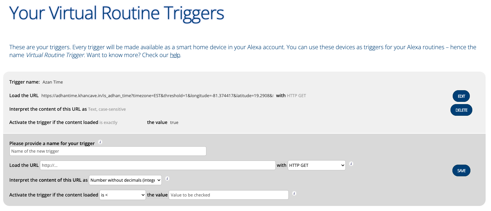
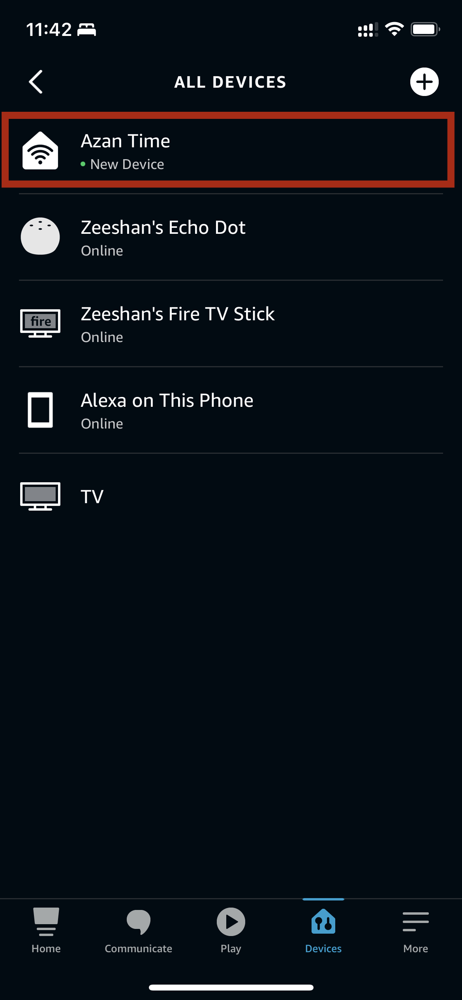
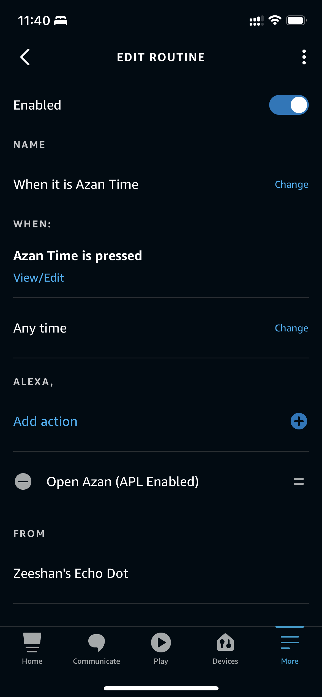

Are you looking to make your Alexa device play the Adhan automatically? Here's a simple solution

## Enabling Alexa Skills
Firstly, enable the following Alexa skills by learning them from your Alexa app:

- Virtual Routine Trigger
- Azan (ALP Enabled)

## Creating a Virtual Device
Next, create a virtual device by visiting the virtualsmarthome.xyz website at this link: https://www.virtualsmarthome.xyz/virtual_routine_trigger/. Link your Amazon account, and then fill in the form with the following information:

Name: `Adhan Time`

Load the URL: `https://adhantime.khancave.in/is_adhan_time?timezone=EST&threshold=1&longitude=-81.374417&latitude=19.2908&fajr_isha_method=1&asr_fiqh=hanafi`

Interpret the content of this URL as: `Text, case-sensitive`

Activate the trigger if the content loaded is exactly the value `true`

See the example device created below:

The values in the URL parameters will work if you are in the Cayman Islands. Otherwise, you'll need to change the timezone, longitude, and latitude values. Refer to the documentation [here](https://adhantime.khancave.in/docs) to learn more about these parameters and test your values to ensure that the Adhan time matches what you're expecting.

After adding the correct values in the URL and saving, a doorbell device will be added to your Alexa account. You can see your device under the "devices" tab in the Alexa app.

## Creating a Routine
Using the newly created device, create a routine that triggers the "Azan (ALP Enabled)" Alexa skill, which will play the Adhan automatically.

 

## How it works
Virtualsmarthome creates a doorbell device in your Alexa app, which is "pressed" if the URL that we provided returns "true". Our URL contains parameters used to calculate prayer times, and when a prayer time starts, our endpoint will return "true", which triggers the routine we created. From Alexa's point of view, the doorbell is pressed, and the routine starts the "Azan" skill, which plays the Adhan.
