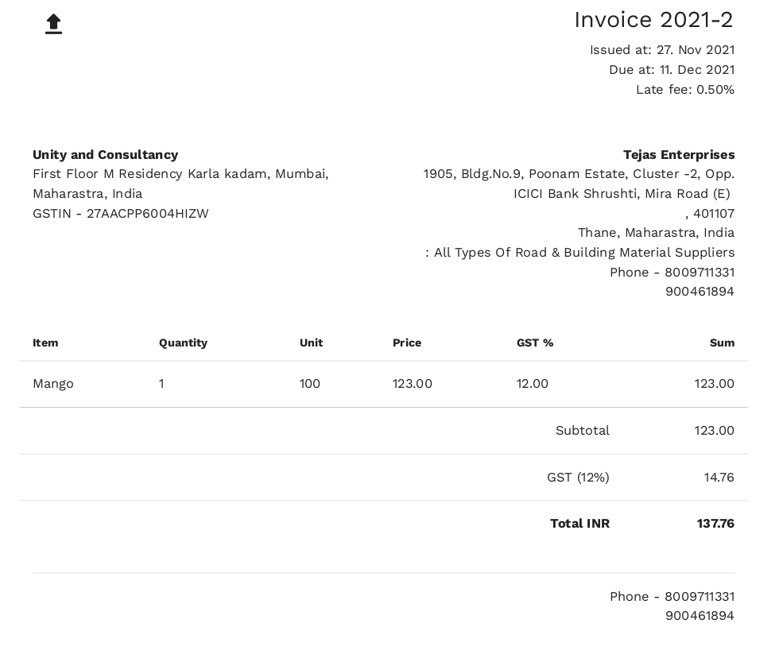
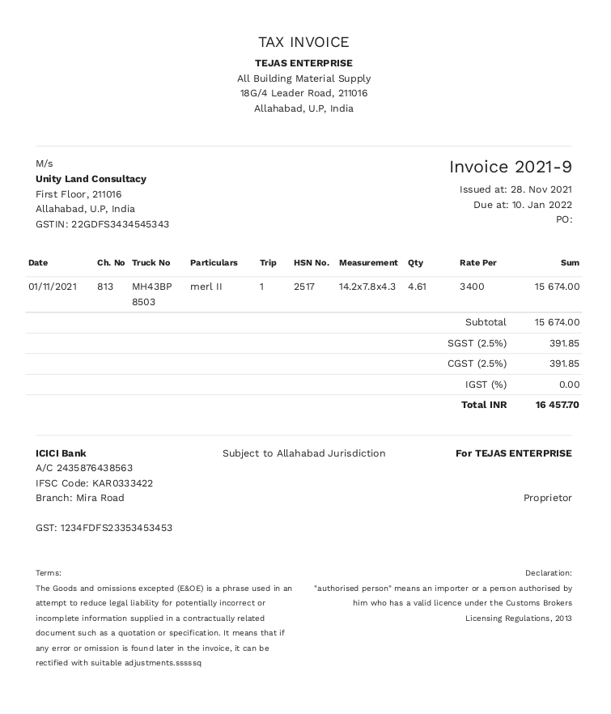

One of my non-techie friend was starting a new business and he wanted a Invoicing System. he reached out to me hoping that I can help him with a small  website or app

## Open Source Software to rescue
If this was me a couple of year earlier I would have started the typical Software Development Life Cycle for a new project, but this new me is lazy.
So, I searched the web to find a decent open-source project that can fullfil his needs for now, 
I came across this [project](https://github.com/mrzool/invoice-boilerplate) it looked very interesting to me, it was using LaTeX to generate the invoice, since I had no experience in the tools I refrained to use it (although I would love to explore it).
after going though a couple of interesting looking projects,
I found something familiar 

## The Base
[Serverless Invoices](https://invoices.mokuapp.io/)
> Create and manage invoices in your browser. Serverless Invoices is a free invoicing tool for freelancers and small businesses. Made with Vue.js.

This was build using [Vue.js]() and the end result was a static website with some Javascript magic to handle the invoicing, it was also persistent data in browser storage. the code base was clean and organized for anyone to build on top of that.

In the past I have build a [website](https://moviepediafilms.com) using [Vue.js]() it was a good experience, after playing with the demo app I felt that it was only missing one major feature that can be added in a day and some layout related changes, so I decided to start with this as base.

*Invoice that the app already generates*

## Missing Feature
The feature that I think was important and is missing was the ability to have custom columns in invoice and a couple of adjustments addition/removal of static sections, I created a form of the project and started tweaking the project to add the feature, I wanted to make the user specify the columns so that the layout of the invoice is also customizable.

## Deployment
I made the so that editing a config file a user can customize the columns, although I wanted to have some form of UI to do that. but since the self-defined-deadlines was little tight I decided to do that later.

*After the modification (this looks more Indian)*

The result was hosted here[invoice.zkhan.in](https://invoice.zkhan.in)